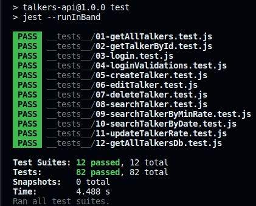

# Talkers Api 🗣️

The Talkers Api is a simple REST API designed for managing a collection of talkers. It provides basic CRUD (Create, Read, Update, Delete) operations to interact with talker data. This API is ideal for applications that require a backend system to handle speaker profiles, interviews, or any scenario where managing talkers' information is essential.

<details>
  <summary>Table of Contents</summary>

  1. [How to run](#how-to-run) 
  2. [API Endpoints](#api-endpoints)
     - [Talker](#talker)
     - [Login](#login)
  3. [Technologies Used](#technologies-used)
  4. [Development](#development)
     - [Requirements List](#requirements-list)
     - [Testing](#testing-by-trybe)
  5. [Acknowledgments](#acknowledgments)
  6. [License](#license)
  7. [Author](#author) 
</details>

## How to run
> To run the project, you will need to have [Node.js](https://nodejs.org/en/) and [Docker](https://www.docker.com/) installed on your machine.

1. Clone the repository
```sh
git clone git@github.com:gabrielmoisesa/talkers-api.git
```

2. Navigate to the project folder
```sh
cd talkers-api
```

3. Start the containers
```sh
docker-compose up -d
```

4. Access the container bash
```sh
docker exec -it talkers-api bash
```

5. Run the application
```sh
npm start
# with nodemon
npm run dev
```

## API Endpoints

### Talker:

`GET /talker` - Get all talkers

`GET /talker/:id` - Get talker by id

`GET /talker/db` - Get talkers from mysql database

`GET /talker?q=${name}&rate=${rate}&date=${date}` - Get talkers by query params

`POST /talker` - Create a new talker

`PUT /talker/:id` - Update talker by id

`PATCH /talker/rate/:id` - Update talker rate by id

`DELETE /talker/:id` - Delete talker by id

### Login:

`POST /login` - Login

## Technologies Used

- Node.js
- Express.js
- MySQL 2 

## Development

The development of the project was based in requirements and testing by [Trybe](https://github.com/tryber) course.

### Requirements List

<details>
   <summary>Requirements</summary>

- [x] **1.** Create the GET /talker endpoint

- [x] **2.** Create the GET /talker/:id endpoint

- [x] **3.** Create the POST /login endpoint

- [x] **4.** Add validations for the /login endpoint

- [x] **5.** Create the POST /talker endpoint

- [x] **6.** Create the PUT /talker/:id endpoint

- [x] **7.** Create the DELETE /talker/:id endpoint

- [x] **8.** Create the GET /talker/search?q=searchTerm endpoint

- [x] **9.** Create the minRate=rateNumber query parameter in the GET /talker/search endpoint

- [x] **10.** Create the query parameter date=watchedDate in the GET /talker/search endpoint

- [x] **11.** Create the PATCH /talker/rate/:id endpoint

- [x] **12.** Create the GET /talker/db endpoint

</details>

### Testing (by [Trybe](https://github.com/tryber))

The project was developed based on tests and have all the cases covered.

#### Screenshot



#### Running Tests

```sh
# Access the container bash
docker exec -it talker_manager bash
# Run tests
npm test
# Run a specific test
npm test 01
# Run lint
npm run lint
```

## Acknowledgments

- [Trybe](https://github.com/tryber) - Configuration and testing

## License

[MIT](LICENSE)

## Author

- [@gabrielmoisesa](https://github.com/gabrielmoisesa)